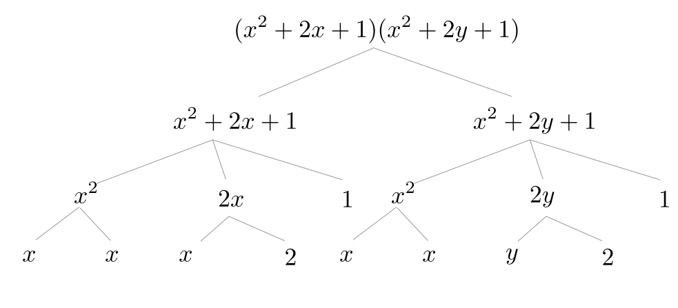
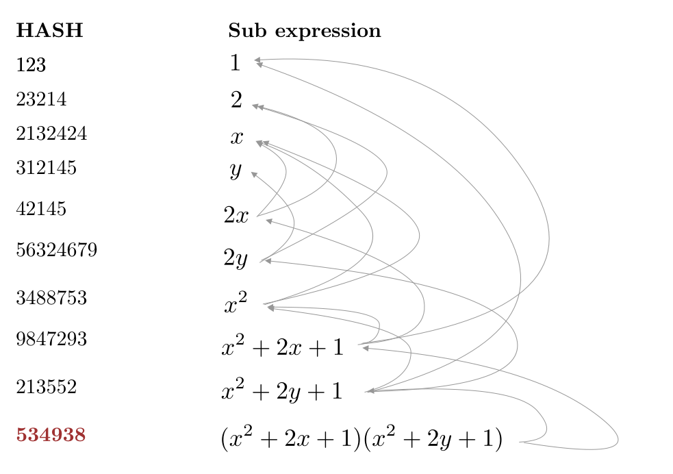

# Contributing
## Why Hashed Expression
Normally, we would see (arithmetic) expressions represented as tree.
For example, the expression `f = (xy + 2x + 1)xy`


How do we evaluate `f` with a given value of `x` and `y`, e.g `x = 2`, `y = 3`?
Such function would be something like this in Haskell:
```haskell
evaluate :: Substitution -> Exp -> Int
evaluate sub exp = case exp of 
    Add xs -> sum . map (evaluate sub) $ xs
    Mul xs -> product . map (evaluate sub) $ xs
    Var name -> sub name
    Const num -> num
    ...
```

Basically, we call evaluate on every subtree/node/leaf of the tree. This is inefficient. 
For example, `evaluate sub x` is called 4 times.

So we want to identify all the common subexpressions and link them accordingly.
Now the expression is no longer a Tree, but a Directed Acyclic Graph (DAG). 


Let's analyze this DAG a bit:
- It's a single-root DAG.
- Each node uniquely represents a subexpression, and has:
    - (1) Information of the subexpression it represents (what kind of operation, etc, ..)
    - (2) Pointers to it's subexpressions

So what kind of data structure should we use for this kind of DAG?

Our approach: each node/subexpression is uniquely indexed by hash of (1) and (2). 
The expression is now a hash table with a root node ID.


(Root ID is in maroon color)

Or explicitly:


## Generating Haddock (with Docker)
Build the docker image located in docs (it's important you do this from the root of the repo), with
```terminal
docker build -t hashed-docker -f docs/Dockerfile .
```
-Then run the docker container to generate the haddock documentation (NOTE: every time you alter the 
-code base you'll have to rebuild the image)
```terminal
-docker run -v /some/path:/home/HashedExpression/docs hashed-docker
```
-this will generate all the haddock documentation (in html) into */some/path* on your local system

