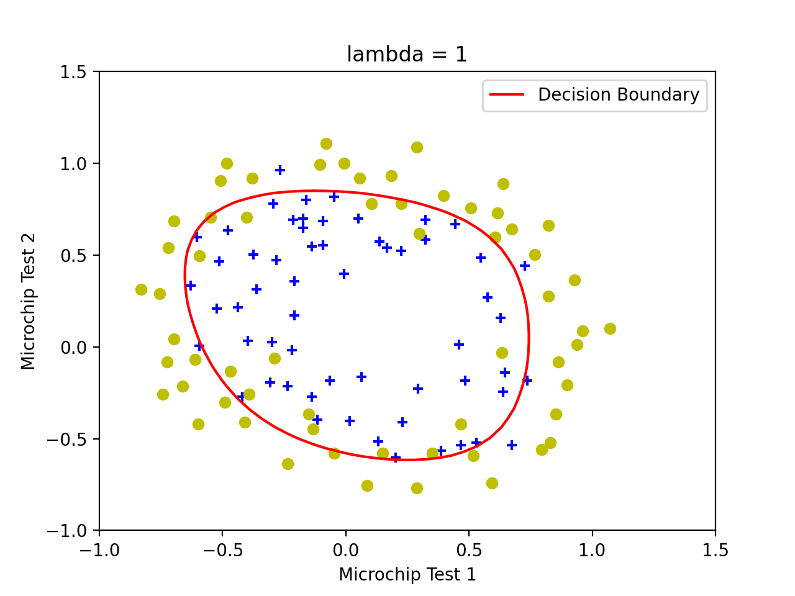

# HashedExpression [](https://app.wercker.com/project/byKey/fce29884fa47e4258f62240000f1e368)
A type-safe symbolic computing Haskell embeded DSL for solving optimization problems.

## Motivation

## Examples

For those examples taken from Coursera's [Machine Learning](https://www.coursera.org/learn/machine-learning), data and plotting scripts are based on https://github.com/nsoojin/coursera-ml-py. 

### Linear regression
Taken from [exercise 1](https://github.com/nsoojin/coursera-ml-py/tree/master/machine-learning-ex1) - [Machine Learning](https://www.coursera.org/learn/machine-learning) - Coursera.

Model is in [app/Examples/Ex1.hs](app/Examples/Ex1.hs), data is in [examples/ex1](examples/ex1)

```haskell
ex1_linearRegression :: OptimizationProblem
ex1_linearRegression =
  let x = param1D @97 "x"
      y = param1D @97 "y"
      theta0 = variable "theta0"
      theta1 = variable "theta1"
      objective = norm2square ((theta0 *. 1) + (theta1 *. x) - y)
   in OptimizationProblem
        { objective = objective,
          constraints = [],
          values =
            [ x :-> VFile (TXT "x.txt"),
              y :-> VFile (TXT "y.txt")
            ],
          workingDir = "problems" </> "ex1"
        }

ex1 :: IO ()
ex1 = proceed ex1_linearRegression CSimpleConfig {output = OutputText}
```
(`(*.)` is scaling )


### Logistic regression
Taken from [exercise 2](https://github.com/nsoojin/coursera-ml-py/tree/master/machine-learning-ex2) - [Machine Learning](https://www.coursera.org/learn/machine-learning) - Coursera.

Model is in [app/Examples/Ex2.hs](app/Examples/Ex2.hs), data is in [examples/ex2](examples/ex2)

```haskell
sigmoid :: (Dimension d) => Expression d R -> Expression d R
sigmoid x = 1.0 / (1.0 + exp (-x))

ex2_logisticRegression :: OptimizationProblem
ex2_logisticRegression =
  let x = param2D @118 @28 "x"
      y = param2D @118 @1 "y"
      theta = variable2D @28 @1 "theta"
      hypothesis = sigmoid (x ** theta)
      lambda = 1
      regTheta = project (range @1 @27, at @0) theta
      regularization = (lambda / 2) * (regTheta <.> regTheta)
   in OptimizationProblem
        { objective = sumElements ((-y) * log hypothesis - (1 - y) * log (1 - hypothesis)) + regularization,
          constraints = [],
          values =
            [ x :-> VFile (TXT "x_expanded.txt"),
              y :-> VFile (TXT "y.txt")
            ],
          workingDir = "problems" </> "ex2"
        }

ex2 :: IO ()
ex2 = proceed ex2_logisticRegression CSimpleConfig {output = OutputText}
```

( `(**)` is matrix multiplication, `(<.>)` is dot product, `project (range @1 @27, at @0) theta` is the typed version of `theta[1:27,0]` )




### MRI Reconstruction

Model is in [app/Examples/Brain.hs](app/Examples/Brain.hs), data is in [examples/brain](examples/brain)

```haskell
brain_reconstructFromMRI :: OptimizationProblem
brain_reconstructFromMRI =
  let -- variables
      x = variable2D @128 @128 "x"
      -- parameters
      im = param2D @128 @128 "im"
      re = param2D @128 @128 "re"
      mask = param2D @128 @128 "mask"
      -- regularization
      lambda = 3000
      regularization = lambda * (norm2square (rotate (0, 1) x - x) + norm2square (rotate (1, 0) x - x))
   in OptimizationProblem
        { objective = norm2square ((mask +: 0) * (ft (x +: 0) - (re +: im))) + regularization,
          constraints =
            [ x .<= VFile (HDF5 "bound.h5" "ub"),
              x .>= VFile (HDF5 "bound.h5" "lb")
            ],
          values =
            [ im :-> VFile (HDF5 "kspace.h5" "im"),
              re :-> VFile (HDF5 "kspace.h5" "re"),
              mask :-> VFile (HDF5 "mask.h5" "mask")
            ],
          workingDir = "problems" </> "brain"
        }

brain :: IO ()
brain = proceed brain_reconstructFromMRI CSimpleConfig {output = OutputHDF5}
```


## Contributing
Please read `Contributing.md`. PRs are welcome.

## About
The project is developed and maintained by [Dr. Christopher Anand](https://github.com/christopheranand)'s research group, Computing and Software department, McMaster University.

List of contributors:
- [Nhan Thai](https://github.com/dandoh)
- [Curtis D'alves](https://github.com/dalvescb)
- [Christopher Anand](https://github.com/christopheranand)
- ...

