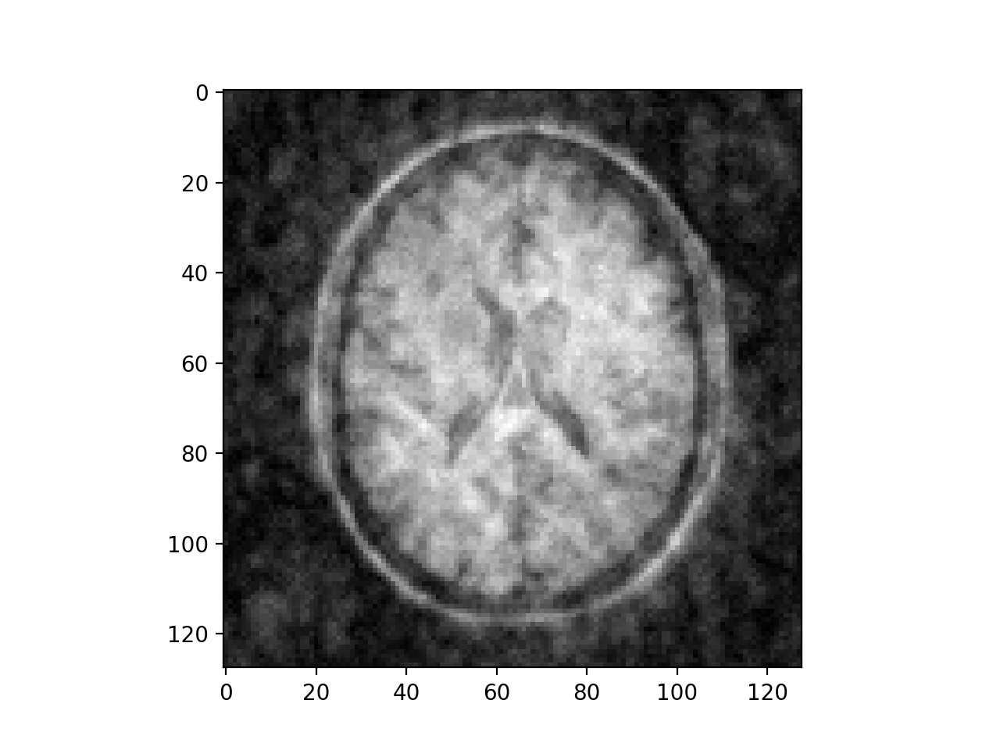

# HashedExpression 
[](https://app.wercker.com/project/byKey/fce29884fa47e4258f62240000f1e368)

Type-safe modelling DSL, symbolic transformation, and code generation for solving optimization problems.


## Features
- A type-safe, correct-by-construction APIs to model optimization problems, empowered by Haskell's phantom-type and type-level programming.
    - For example, adding 2 expressions with mismatched shape or element type (**R** or C) will result in type error will result in type error:
    ```haskell
    λ> let x = variable1D @10 "x"
    λ> let y = variable1D @9 "y"
    λ> :t x
    x :: TypedExpr '[10] 'R
    λ> :t y
    y :: TypedExpr '[9] 'R
    λ> x + y
    <interactive>:5:5: error:
        • Couldn't match type ‘9’ with ‘10’
          Expected type: TypedExpr '[10] 'R
            Actual type: TypedExpr '[9] 'R
        • In the second argument of ‘(+)’, namely ‘y’
          In the expression: x + y
          In an equation for ‘it’: it = x + y
    ```
    ```haskell
    λ> let x = variable1D @10 "x"
    λ> let x = variable2D @10 @10 "x"
    λ> let y = variable2D @10 @10 "y"
    λ> let c = x +: y
    λ> :t c
    c :: TypedExpr '[10, 10] 'C
    λ> let z = variable2D @10 @10 "z"
    λ> :t z
    z :: TypedExpr '[10, 10] 'R
    λ> z + c
    
    <interactive>:13:5: error:
        • Couldn't match type ‘'C’ with ‘'R’
          Expected type: TypedExpr '[10, 10] 'R
            Actual type: TypedExpr '[10, 10] 'C
          Type synonyms expanded:
          Expected type: TypedExpr '[10, 10] 'R
            Actual type: TypedExpr '[10, 10] 'C
        • In the second argument of ‘(+)’, namely ‘c’
          In the expression: z + c
          In an equation for ‘it’: it = z + c
    ```
    
- Automatically simplify expressions and compute derivatives, identify common subexpressions.
    - We represent expressions symbolically. Expressions are hashed and indexed in a common lookup table, thus allows for identifying common subexpressions.
    - Derivatives are computed by reverse accumulation method.
- Generate code which can be feed to optimization solvers (such as LBFGS, LBFGS-B, Ipopt, see [solvers](solvers)).
    - Currently, we have a code generator that produce C99 code. 
    - Since code generation is decoupled from all other steps, we could easily provide other generators. A version of SIMD C is WIP, and later a GPU version.

Supported operations:
- basic algebraic operations: addition, multiplication, etc.
- complex related: real, imag, conjugate, etc.
- trigonometry, log, exponential, power.
- rotation, projection (think of Python's slice notation, but with type-safety), and injection (reverse of projection)
- piecewise function 
- Fourier Transform, inverse Fourier Transform
- dot product (inner product), matrix multiplication

## Examples

For those examples taken from Coursera's [Machine Learning](https://www.coursera.org/learn/machine-learning), data and plotting scripts are based on https://github.com/nsoojin/coursera-ml-py. 

### Linear regression
Taken from [exercise 1](https://github.com/nsoojin/coursera-ml-py/tree/master/machine-learning-ex1) - [Machine Learning](https://www.coursera.org/learn/machine-learning) - Coursera.

Model is in [app/Examples/LinearRegression.hs](app/Examples/LinearRegression.hs), data & plotting script is in [examples/LinearRegression](examples/LinearRegression)

```haskell
ex1_linearRegression :: OptimizationProblem
ex1_linearRegression =
  let x = param1D @97 "x"
      y = param1D @97 "y"
      theta0 = variable "theta0"
      theta1 = variable "theta1"
      objective = norm2square ((theta0 *. 1) + (theta1 *. x) - y)
   in OptimizationProblem
        { objective = objective,
          constraints = [],
          values =
            [ x :-> VFile (TXT "x.txt"),
              y :-> VFile (TXT "y.txt")
            ],
          workingDir = "examples" </> "LinearRegression"
        }

ex1 :: IO ()
ex1 = proceed ex1_linearRegression CSimpleConfig {output = OutputText}
```
(`(*.)` is scaling )


### Logistic regression
Taken from [exercise 2](https://github.com/nsoojin/coursera-ml-py/tree/master/machine-learning-ex2) - [Machine Learning](https://www.coursera.org/learn/machine-learning) - Coursera.

Model is in [app/Examples/LogisticRegression.hs](app/Examples/LogisticRegression.hs), data & plotting script is in [examples/LogisticRegression](examples/LogisticRegression)

```haskell
sigmoid :: (IsShape d) => TypedExpr d R -> TypedExpr d R
sigmoid x = 1.0 / (1.0 + exp (- x))

ex2_logisticRegression :: OptimizationProblem
ex2_logisticRegression =
  let -- variables
      theta = variable1D @28 "theta"
      -- parameters
      x = param2D @118 @28 "x"
      y = param1D @118 "y"
      hypothesis = sigmoid (x ** theta)
      -- regularization
      lambda = 1
      regTheta = project (range @1 @27) theta
      regularization = (lambda / 2) * (regTheta <.> regTheta)
   in OptimizationProblem
        { objective = sumElements ((- y) * log hypothesis - (1 - y) * log (1 - hypothesis)) + regularization,
          constraints = [],
          values =
            [ x :-> VFile (TXT "x_expanded.txt"),
              y :-> VFile (TXT "y.txt")
            ],
          workingDir = "examples" </> "LogisticRegression"
        }

ex2 :: IO ()
ex2 = proceed ex2_logisticRegression CSimpleConfig {output = OutputText}
```

( `(**)` is matrix multiplication, `(<.>)` is dot product, `project (range @1 @27, at @0) theta` is the typed version of `theta[1:27,0]` )


### MRI Reconstruction

Model is in [app/Examples/Brain.hs](app/Examples/Brain.hs), data is in [examples/Brain](examples/Brain)

```haskell
brain_reconstructFromMRI :: OptimizationProblem
brain_reconstructFromMRI =
  let -- variables
      x = variable2D @128 @128 "x"
      -- parameters
      im = param2D @128 @128 "im"
      re = param2D @128 @128 "re"
      mask = param2D @128 @128 "mask"
      -- regularization
      lambda = 3000
      regularization = lambda * (norm2square (rotate (0, 1) x - x) + norm2square (rotate (1, 0) x - x))
   in OptimizationProblem
        { objective = norm2square ((mask +: 0) * (ft (x +: 0) - (re +: im))) + regularization,
          constraints =
            [ x .<= VFile (HDF5 "bound.h5" "ub"),
              x .>= VFile (HDF5 "bound.h5" "lb")
            ],
          values =
            [ im :-> VFile (HDF5 "kspace.h5" "im"),
              re :-> VFile (HDF5 "kspace.h5" "re"),
              mask :-> VFile (HDF5 "mask.h5" "mask")
            ],
          workingDir = "examples" </> "Brain"
        }

brain :: IO ()
brain = proceed brain_reconstructFromMRI CSimpleConfig {output = OutputHDF5}
```




### Neural network
Taken from [exercise 4](https://github.com/nsoojin/coursera-ml-py/tree/master/machine-learning-ex4) - [Machine Learning](https://www.coursera.org/learn/machine-learning) - Coursera.

Model is in [app/Examples/NeuralNetwork.hs](app/Examples/NeuralNetwork.hs), data & plotting script is in [examples/NeuralNetwork](examples/NeuralNetwork)

```haskell
sigmoid :: (IsShape d) => TypedExpr d R -> TypedExpr d R
sigmoid x = 1.0 / (1.0 + exp (- x))

prependColumn ::
  forall m n.
  (Injectable 0 (m - 1) m m, Injectable 1 n n (n + 1)) =>
  Double ->
  TypedExpr '[m, n] R ->
  TypedExpr (D2 m (n + 1)) R
prependColumn v exp = inject (range @0 @(m - 1), range @1 @n) exp (constant2D @m @(n + 1) v)

ex4_neuralNetwork :: OptimizationProblem
ex4_neuralNetwork =
  let x = param2D @5000 @400 "x"
      y = param2D @5000 @10 "y"
      -- variables
      theta1 = variable2D @401 @25 "theta1"
      theta2 = variable2D @26 @10 "theta2"
      -- neural net
      a1 = prependColumn 1 x
      z2 = sigmoid (a1 ** theta1)
      a2 = prependColumn 1 z2
      hypothesis = sigmoid (a2 ** theta2)
      -- regularization
      lambda = 1
      regTheta1 = project (range @1 @400, range @0 @24) theta1 -- no first row
      regTheta2 = project (range @1 @25, range @0 @9) theta2 -- no first row
      regularization = (lambda / 2) * (norm2square regTheta1 + norm2square regTheta2)
   in OptimizationProblem
        { objective = sumElements ((- y) * log hypothesis - (1 - y) * log (1 - hypothesis)) + regularization,
          constraints = [],
          values =
            [ x :-> VFile (HDF5 "data.h5" "x"),
              y :-> VFile (HDF5 "data.h5" "y")
            ],
          workingDir = "examples" </> "NeuralNetwork"
        }

ex4 :: IO ()
ex4 = proceed ex4_neuralNetwork CSimpleConfig {output = OutputHDF5, maxIteration = Just 400}
```


(The second image visualizes the (trained) hidden layer. Training set accuracy 99.64%)

## Contributing
Please read `Contributing.md`. PRs are welcome.

## About
The project is developed and maintained by [Dr. Christopher Anand](https://github.com/christopheranand)'s research group, Computing and Software department, McMaster University.

List of contributors:
- [Nhan Thai](https://github.com/dandoh)
- [Curtis D'alves](https://github.com/dalvescb)
- [Christopher Anand](https://github.com/christopheranand)
- [Christopher Schankula](https://github.com/CSchank)
- [Nasim Khoonkari ](https://github.com/Nasim91)
- [Habib Ghaffari Hadigheh](https://github.com/ghhabib2)
- [Padma Pasupathi](https://github.com/padmapasupathi)

