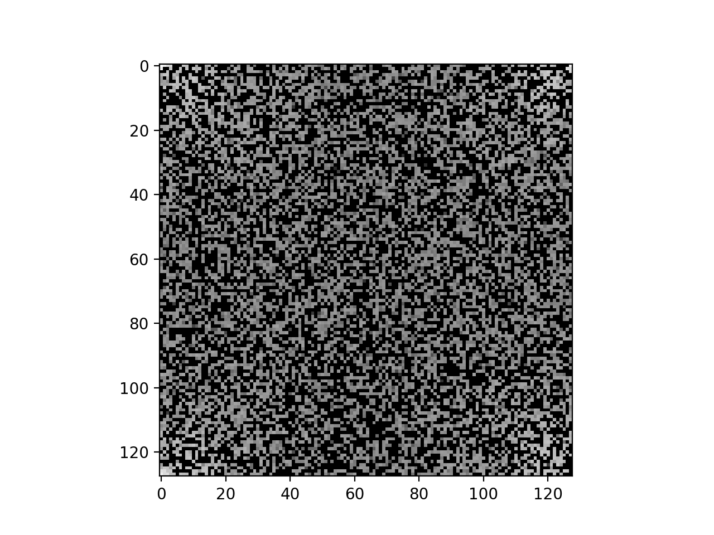
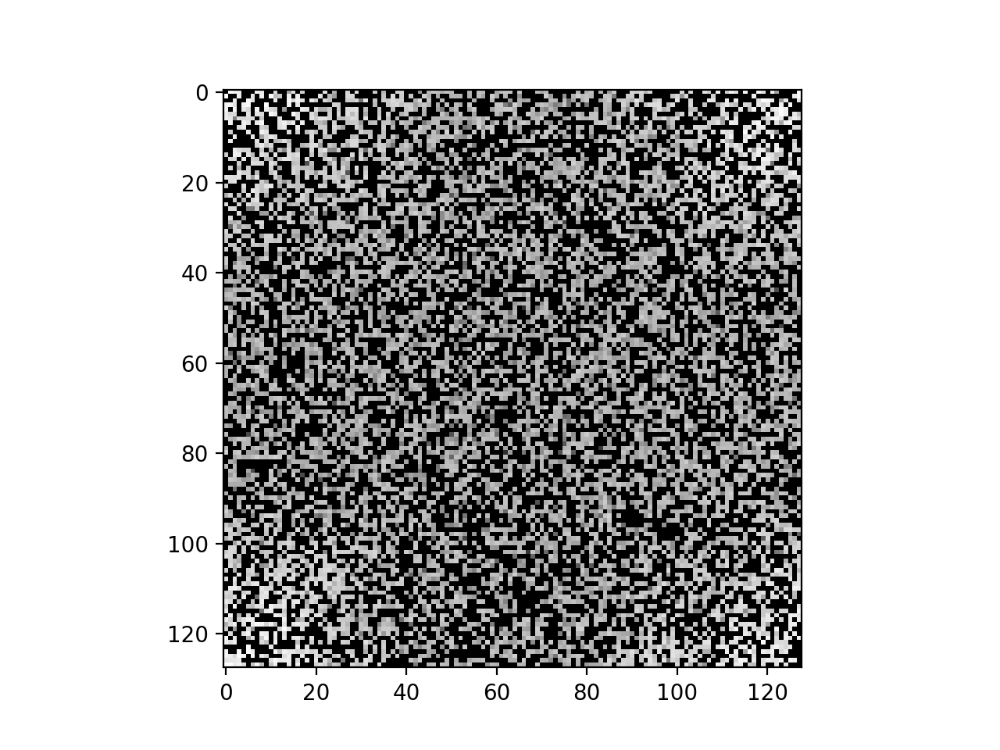
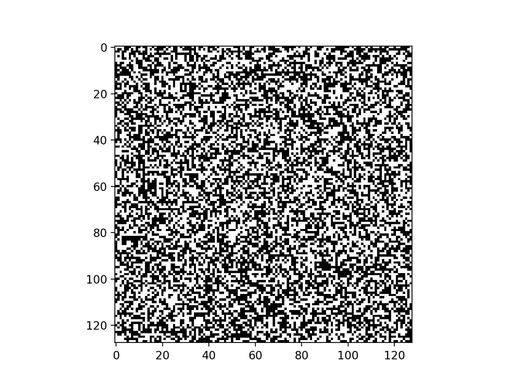
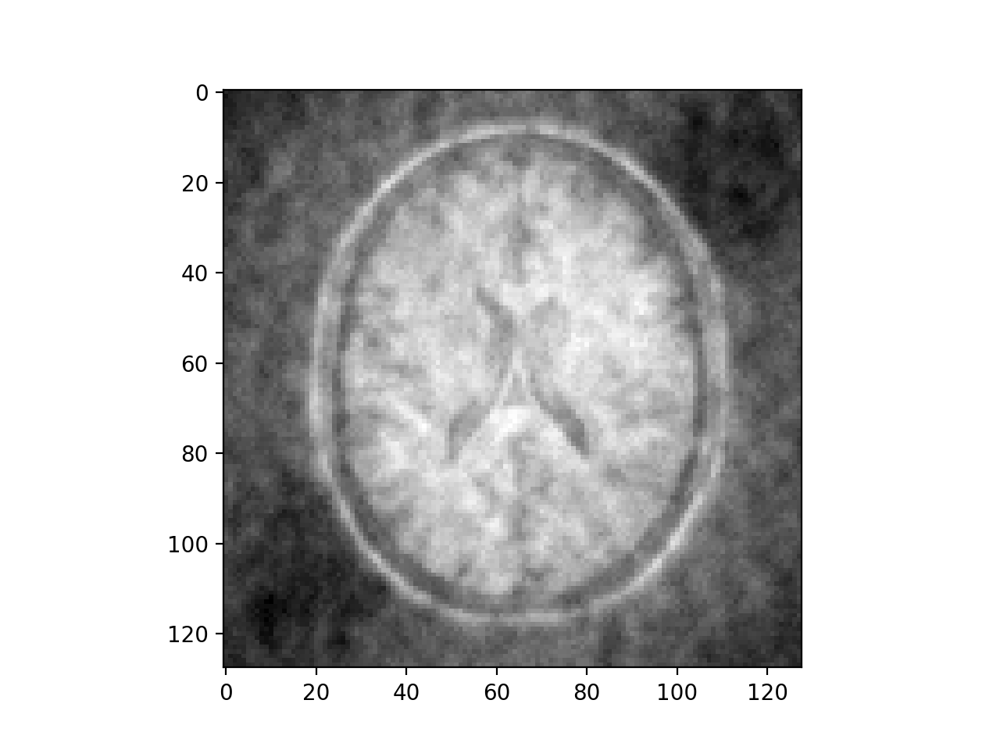
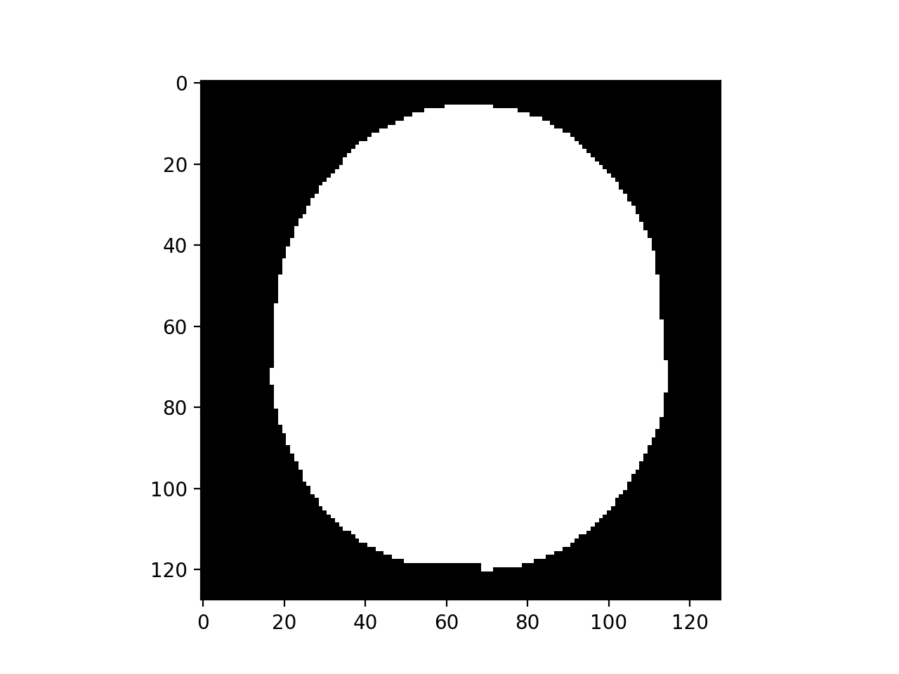
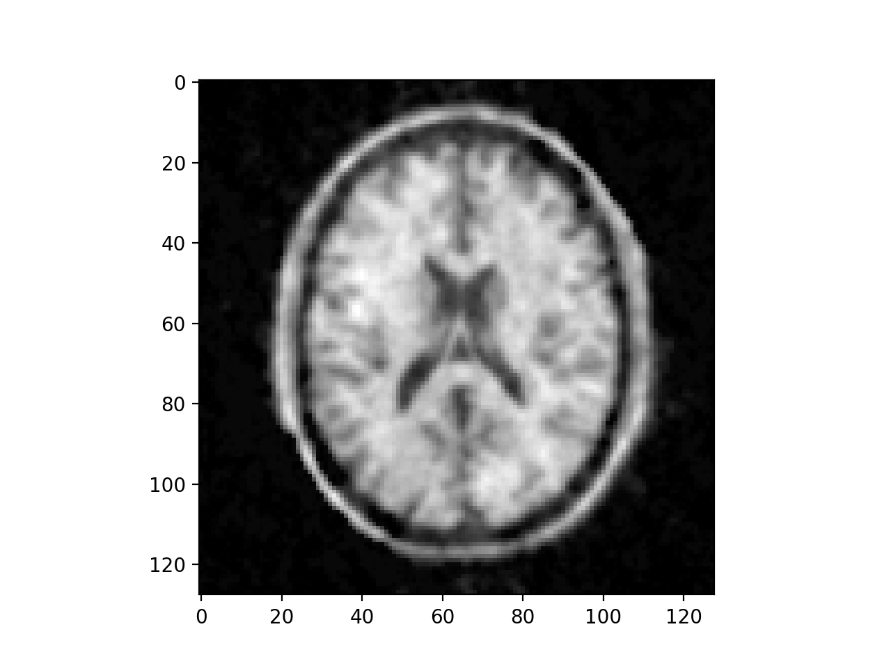
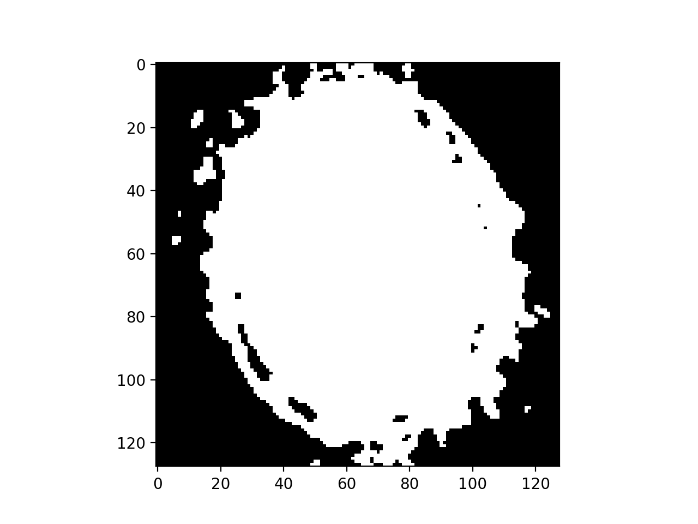

# Run

- Make sure `symphony` is in the $PATH, if haven't, do it by:
```terminal
stack install --ghc-options -O2
```

- In this `Brain` folder:
```terminal
make
```

# Files
- `kspace.h5` dataset contains loss kspace data, real part in key "re", imag part in key "im"
    - `loss_kspace_re.png` shows the real part
    - `loss_kspace_im.png` shows the imag part
   
   

    
- `mask.h5` dataset contains the mask (key "mask") which indicates which part of the kspace signal is lost
    - `mask.png` plots mask
    
- `naive.png` shows inverse FFT of above real and imag data
    
- `bound.h5` dataset contains bound constraints, lower bound in "lb", upper bound in "ub"
    - They are generated from `head.png` which is inferred from `naive.png`
    
    
    
- `brain.sp` is the model written in symphony

- `result.img` the reconstructed image using our model in `brain.sp`
    


# Appendix
- Old head:
    
- Old result:
    
    


    
